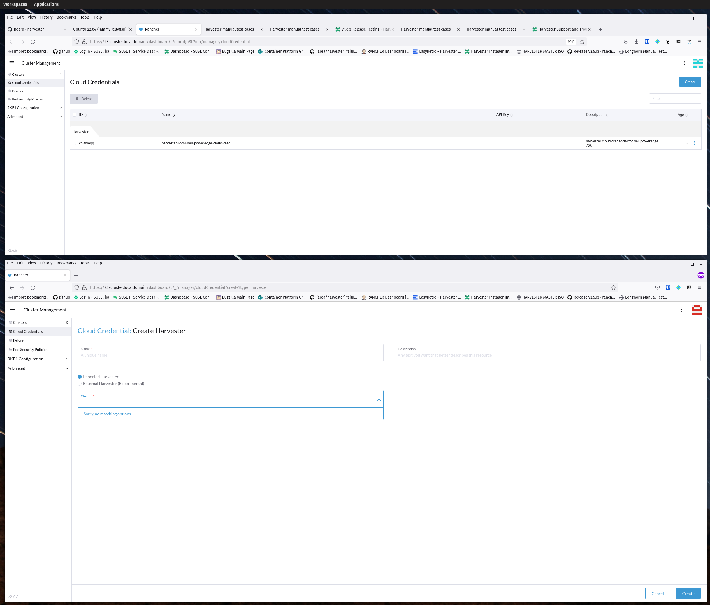
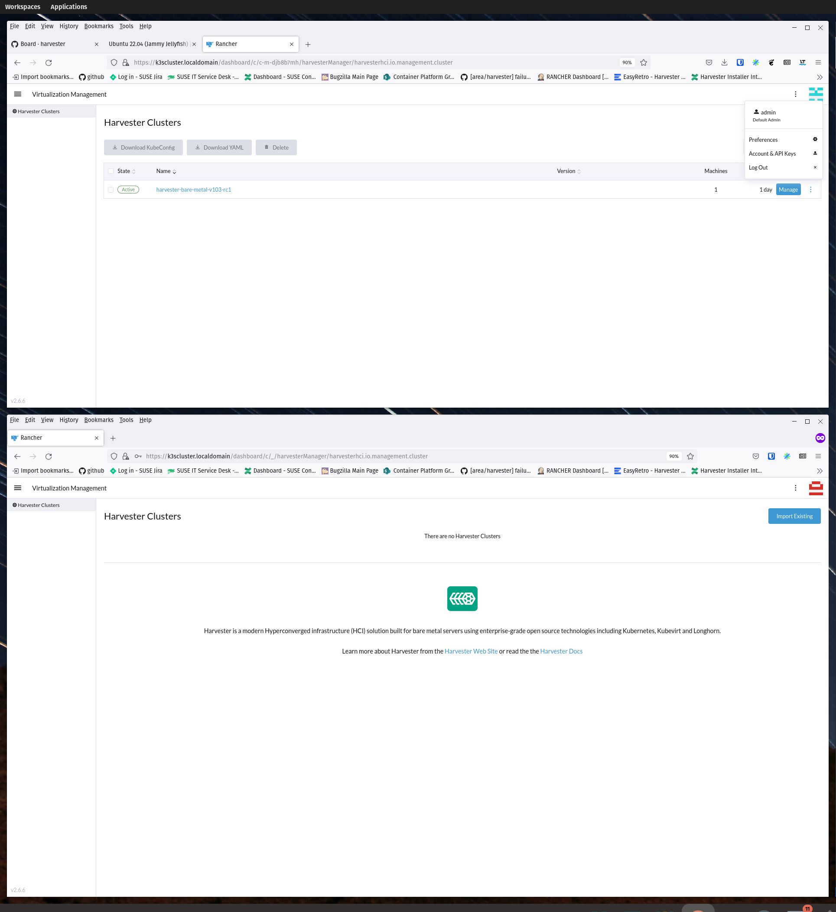
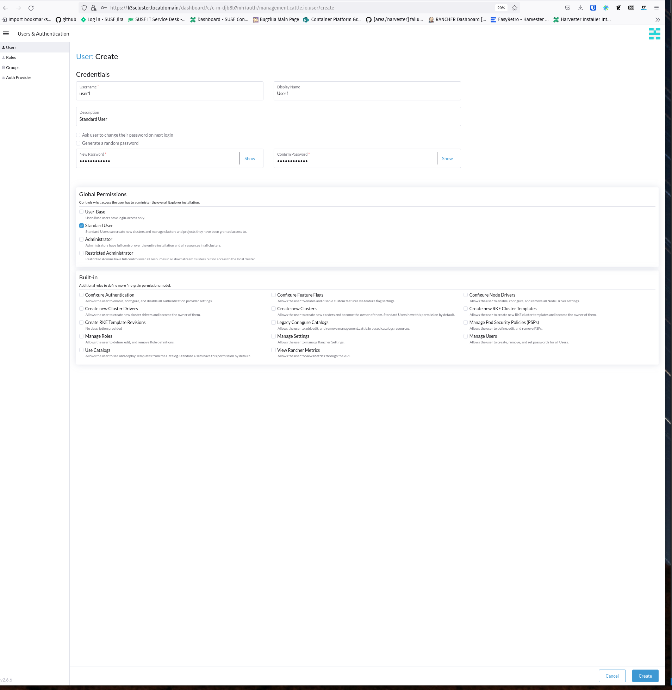
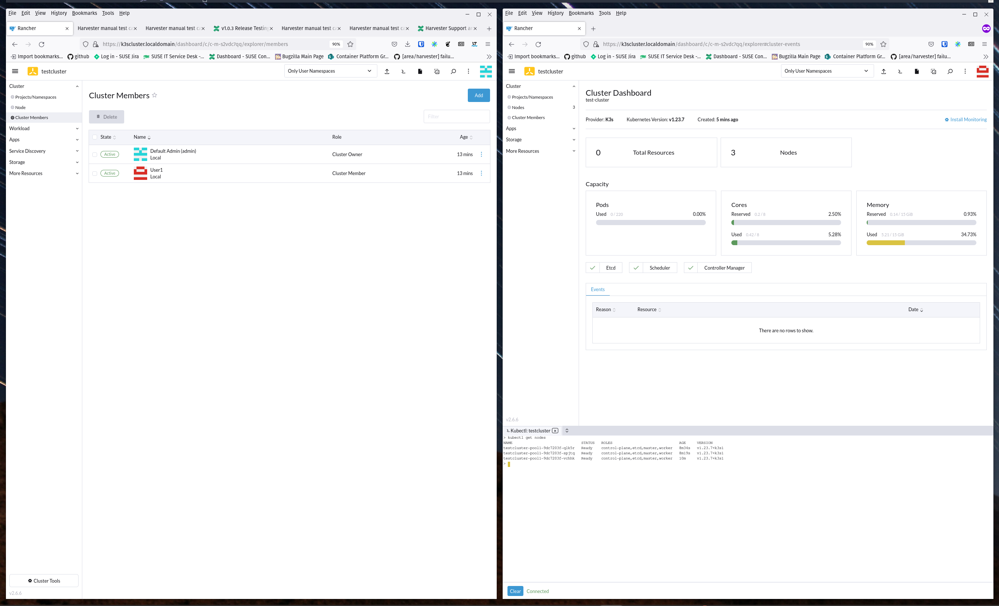

# Test Run: 07/26/22
# Test Result: PASS
# Test-Case: https://harvester.github.io/tests/manual/harvester-rancher/39-rbac-standard-user-no-access/

# Notes:
- verified User1/user1 based Standard User is unable to see virtualization, cloud credentials, etc.
- verified User1/user1 is able to see the cluster they are a cluster member of

