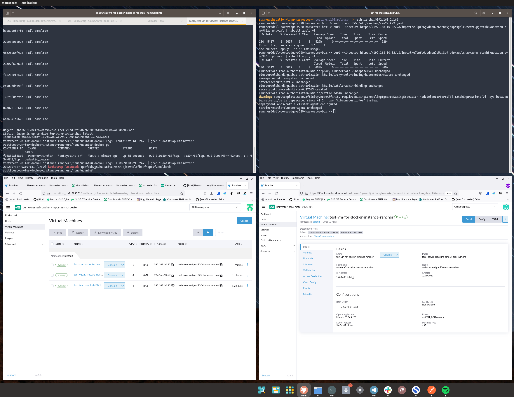
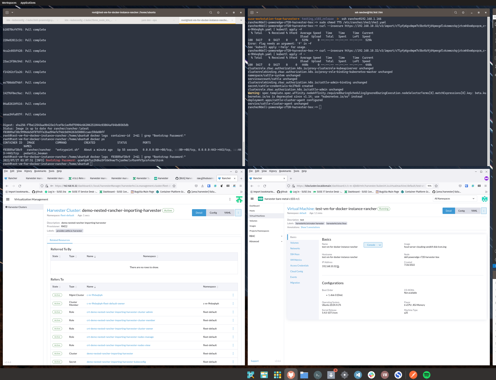

# Test Run: 08/26/22
# Test Result: PASS
# Test-Case: https://harvester.github.io/tests/manual/harvester-rancher/41-rancher-nested-harvester/

# Notes:
- can run a vm that runs distro to install rancher
- install rancher on the vm via cloud init and other
- validated shelling into the vm, running docker rancher
- curled out to the endpoint, grabbed yaml and applied it manually on harvester node 





### Cloud-Init Used:
```
#cloud-config
password: ubuntupw
chpasswd:
  expire: false
ssh_pwauth: true
package_update: true
packages:
  - qemu-guest-agent
  - apt-transport-https
  - ca-certificates
  - curl
  - gnupg-agent
  - gnupg
  - lsb-release
  - software-properties-common
runcmd:
  - - systemctl
    - enable
    - '--now'
    - qemu-guest-agent.service
  - curl -fsSL https://download.docker.com/linux/ubuntu/gpg | apt-key add -
  - >-
    add-apt-repository "deb [arch=$(dpkg --print-architecture)]
    https://download.docker.com/linux/ubuntu $(lsb_release -cs) stable"
  - apt-get update -y
  - >-
    apt-get install -y docker-ce docker-ce-cli containerd.io
    docker-compose-plugin
  - systemctl enable --now qemu-guest-agent.service
  - systemctl start docker
  - systemctl enable docker
```