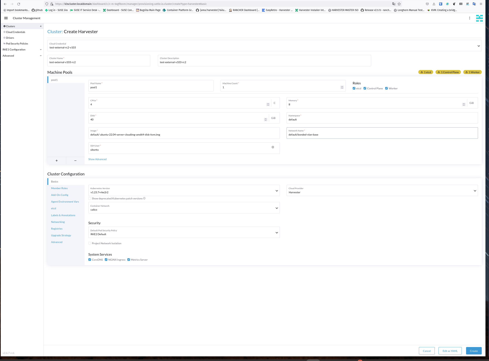

## Test Case: Test External Cloud Credential
## Test Date: 08/08/22
### Result: FAILED



Fails, creating gets hung, vm never builds.

```
Failed waiting for: The cluster to become available. It's possible the cluster was created. We suggest checking the clusters page before trying to create another.
```

RKE2 Test.