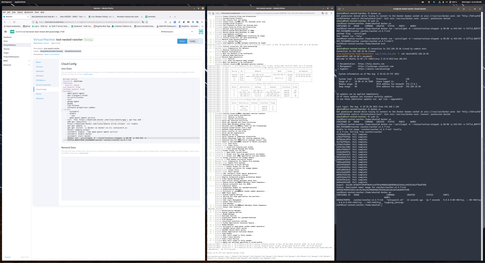

## Test Case: Test Nested Rancher Import Harvester
## Test Date: 08/08/22
### RESULT: - First-Iteration-With-22.04: Failed  - Second-Iteration-With-20.04: Passed

## NOTE: 22.04, should be fixed in Rancher 2.7 Release: https://github.com/rancher/qa-tasks/issues/448

## Setup:
- 6 vCPU & 12 Gi Memory
- 50Gi Disk
- Provisioning using cloud-config 
- Ubuntu based VMs
# Failing Image For VM:
- https://cloud-images.ubuntu.com/releases/jammy/release-20220808/ubuntu-22.04-server-cloudimg-amd64-disk-kvm.img

# Working Image For VM: 
- http://cloud-images-archive.ubuntu.com/releases/focal/release-20200423/ubuntu-20.04-server-cloudimg-amd64-disk-kvm.img



Faling to provision Docker based Rancher with 22.04:
```
#cloud-config
password: ubuntupw
chpasswd:
  expire: false
ssh_pwauth: true
package_update: true
packages:
  - qemu-guest-agent
  - apt-transport-https
  - ca-certificates
  - curl
  - gnupg-agent
  - gnupg
  - lsb-release
  - software-properties-common
runcmd:
  - - systemctl
    - enable
    - --now
    - qemu-guest-agent.service
  - curl -fsSL https://download.docker.com/linux/ubuntu/gpg | apt-key add -
  - add-apt-repository "deb [arch=$(dpkg --print-architecture)]
    https://download.docker.com/linux/ubuntu $(lsb_release -cs) stable"
  - apt-get update -y
  - apt-get install -y docker-ce docker-ce-cli containerd.io
    docker-compose-plugin
  - systemctl enable --now qemu-guest-agent.service
  - systemctl enable docker
  - systemctl start docker
  - docker run --privileged -d --restart=unless-stopped -p 80:80 -p 443:443 -e
    CATTLE_BOOTSTRAP_PASSWORD=rancher -e AUDIT_LEVEL=3 rancher/rancher:v2.6.7-rc6
```

K3s keeps exiting, status code 1.

Even manually running: `docker run --privileged -d --restart=unless-stopped -p 80:80 -p 443:443 -e CATTLE_BOOTSTRAP_PASSWORD=rancher rancher/rancher:v2.6.7-rc6`


# UPDATE!!
This works fine with 20.04 Ubuntu Server Cloud Img KVM but not 22.04 Ubuntu Server Cloud Img KVM

# 22.04 Seems to have issues currently with Docker, cross-ref:
- https://github.com/harvester/harvester/issues/2635
- https://github.com/rancher/qa-tasks/issues/448
- https://github.com/rancher/rancher/issues/38362
- https://github.com/rancher/rancher/issues/38541